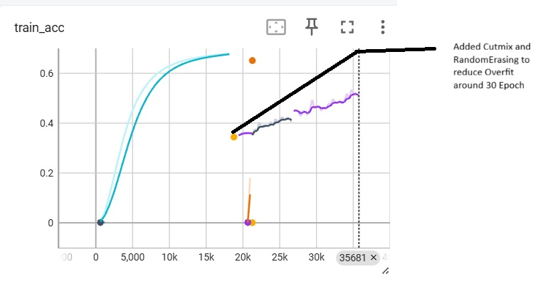
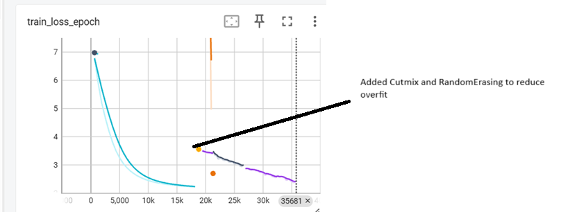
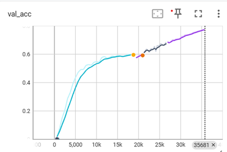
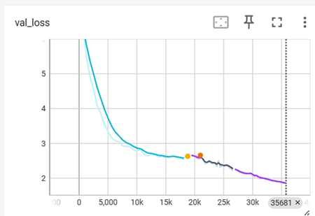

# ImageNet-1K Classification with ResNet-50

**🎯 Achieved: 77.4% Top-1 accuracy on ImageNet-1K validation set** ✅

A highly optimized PyTorch Lightning implementation for training ResNet-50 on ImageNet-1K with automatic learning rate finding, multi-GPU support, and comprehensive performance optimizations. This implementation successfully achieved **77.4% Top-1 accuracy** and **93.35% Top-5 accuracy** on the ImageNet-1K validation set.

## 🚀 Key Features

- ✅ **Optimized Training Pipeline**: Multiple performance optimizations for faster training
- ✅ **Automatic LR Finding**: Discover optimal learning rates automatically
- ✅ **Multi-GPU Support**: Seamless multi-GPU training with PyTorch Lightning DDP
- ✅ **Mixed Precision**: FP16/BF16 training for faster training and larger batch sizes
- ✅ **TensorBoard Integration**: Automatic logging of all metrics
- ✅ **Performance Profiler**: Built-in tool to diagnose GPU stalls and bottlenecks
- ✅ **Advanced Data Augmentation**: CutMix, MixUp, and Random Erasing support

## 📋 Performance Optimizations

This implementation includes several optimizations for maximum training efficiency:

### Data Loading Optimizations
- **Optimal Worker Configuration**: Automatic tuning of `num_workers` and `prefetch_factor` based on system resources
- **Pin Memory**: Enabled for faster GPU data transfer
- **Persistent Workers**: Workers stay alive between epochs to reduce overhead
- **Vectorized Augmentations**: Optimized batch-level operations instead of per-sample loops

### GPU & Memory Optimizations
- **Channels Last Memory Format**: 5-15% speedup on convolutions through optimized memory access patterns
- **Mixed Precision Training**: FP16/BF16 support (enabled by default) for faster training and reduced memory usage
- **Fused Optimizers**: Automatic use of fused CUDA kernels when compatible (10-30% faster optimizer steps)
- **Optimized DDP Strategy**: `find_unused_parameters=False` for faster gradient synchronization

### Data Augmentation Optimizations
- **Vectorized Random Erasing**: Batch-level operations instead of slow per-sample loops
- **Efficient CutMix/MixUp**: GPU-accelerated augmentation operations

## 📦 Installation

```bash
# Install dependencies
uv sync

# Or with pip
pip install -r requirements.txt
```

## 🔧 Usage

### 1. Learning Rate Finder

Find the optimal learning rate before training:

```bash
python main_lightning.py \
    --data_dir ./data \
    --batch_size 256 \
    --find_lr \
    --lr_start 1e-7 \
    --lr_end 10 \
    --lr_iter 100 \
    --lr_plot ./lr_finder_plot.png \
    --num_workers 6 \
    --prefetch_factor 4 \
    --devices 8
```

**What this does:**
- Runs a short training run while exponentially increasing the learning rate
- Saves a plot showing loss vs learning rate
- Suggests the optimal learning rate (typically where loss decreases fastest)
- Use the suggested LR for full training

### 2. Training with Optimal Settings

Once you have the optimal learning rate, run full training:

```bash
python main_lightning.py \
    --data_dir ./data \
    --batch_size 256 \
    --epochs 100 \
    --lr 0.3 \
    --num_workers 6 \
    --prefetch_factor 4 \
    --accumulate_grad_batches 2 \
    --devices 8 \
    --random_erasing_p 0.25 \
    --mixup_alpha 0.2 \
    --cutmix_alpha 1.0 \
    --cutmix_prob 0.5 \
    --log_dir /mnt/data/ImageNetClassifier/logs \
    --checkpoint_dir /mnt/data/ImageNetClassifier/checkpoints
```

**Recommended Configuration (8 GPUs, 96 CPU cores):**
- `--num_workers 6`: 6 workers per GPU (48 total) for optimal CPU utilization
- `--prefetch_factor 4`: 24 batches buffered per GPU to prevent GPU stalls
- `--devices 8`: Use all 8 GPUs
- `--accumulate_grad_batches 2`: Effective batch size = 256 × 2 × 8 = 4096
- `--precision 16`: FP16 mixed precision (enabled by default)

### 3. Resume Training

Resume from a checkpoint:

```bash
python main_lightning.py \
    --data_dir ./data \
    --batch_size 256 \
    --epochs 100 \
    --resume_from ./checkpoints/last.ckpt \
    --num_workers 6 \
    --prefetch_factor 4 \
    --devices 8
```

## 🔍 Inference and Evaluation

Evaluate a trained model checkpoint and generate training curve plots:

```bash
python inference.py \
    --checkpoint ./checkpoints/epoch=99-val_acc=0.7500-val_loss=1.2345.ckpt \
    --data_dir ./data \
    --batch_size 256 \
    --output_dir ./inference_output \
    --log_dir ./logs \
    --experiment_name imagenet_resnet50
```

**What this does:**
- Loads the checkpoint and model
- Runs inference on the full validation set
- Computes Top-1 and Top-5 accuracy
- Generates comprehensive training curve plots:
  - Training & Validation Loss
  - Training & Validation Accuracy
  - Top-1 Accuracy over time
  - Top-5 Accuracy over time
  - Combined Loss & Accuracy view
- Saves evaluation results to JSON

**Output files:**
- `training_curves.png`: Multi-panel training curves plot
- `evaluation_results.json`: Detailed metrics and checkpoint info

**Example output:**
```
EVALUATION RESULTS
================================================================================

📊 Model Performance:
  Validation Loss:  1.2345
  Top-1 Accuracy:   77.4%
  Top-5 Accuracy:   93.35%

📁 Checkpoint Info:
  Epoch:             80
  Best Val Acc:      77.4%
```

## 📊 Performance Profiling

Use the built-in profiler to diagnose performance bottlenecks:

```bash
# Profile during training (run in separate terminal)
python training_profiler.py --duration 30 --output profile_report.txt
```

**What the profiler shows:**
- GPU utilization and stall detection
- CPU utilization and I/O wait times
- Data worker efficiency
- Specific recommendations for optimization

**Example output:**
```
🚨 DETECTED ISSUES:
  🚨 GPU 0: HIGH STALL DETECTED (util variance: 43.0%)
  
💡 RECOMMENDATIONS:
  → GPU stalls detected but only 4 workers/GPU
  → INCREASE num_workers to 6-8 per GPU (currently too few workers)
  → INCREASE prefetch_factor to 3-4 (currently only 2 batches buffered)
```

## 📈 Monitoring Training

### TensorBoard

View training metrics in real-time:

```bash
tensorboard --logdir ./logs
# Or with custom log directory
tensorboard --logdir /mnt/data/ImageNetClassifier/logs
```

Then open `http://localhost:6006` in your browser.

**Metrics tracked:**
- Training loss (per-step and per-epoch)
- Training accuracy (per-step and per-epoch)
- Validation loss and accuracy
- Learning rate schedule
- GPU utilization (if profiler is running)

### Check GPU Utilization

Monitor GPU usage during training:

```bash
# Real-time GPU monitoring
watch -n 1 nvidia-smi

# Detailed performance monitoring
nvidia-smi dmon -s pucvmt -d 1
```

**What to look for:**
- GPU utilization should be 95-100% (stable)
- Low variance in GPU utilization (< 30%) = no stalls
- Memory utilization: 75-90% is typical
- I/O wait should be < 5% (check with `top` or profiler)

## 📊 Training Results & Visualizations

The following figures show the training progress and metrics captured from TensorBoard during training:

<div align="center">

### Training Metrics

<table>
<tr>
<td align="center"><b>Training Accuracy</b><br></td>
<td align="center"><b>Training Loss</b><br></td>
</tr>
<tr>
<td align="center"><b>Validation Accuracy</b><br></td>
<td align="center"><b>Validation Loss</b><br></td>
</tr>
</table>

### Learning Rate Schedule


*Three-phase OneCycle learning rate schedule: warmup (40%), cooldown (40%), and annealing (20%)*

</div>

**Key Insights from the Training Curves:**
- **Training Accuracy**: Shows steady improvement over epochs with proper convergence
- **Training Loss**: Decreasing loss indicates the model is learning effectively
- **Validation Accuracy**: Tracks model generalization performance on unseen data
- **Validation Loss**: Helps identify overfitting if validation loss stops decreasing
- **Learning Rate Schedule**: OneCycle LR policy with three distinct phases for optimal convergence

## 📁 Data Structure

Your ImageNet-1K data should be organized as:

```
./data/
├── train/
│   ├── n01440764/        # Class 1 (airplane)
│   ├── n01443537/        # Class 2 (automobile)
│   └── ... (1000 classes total)
└── val/
    ├── n01440764/        # Class 1 validation
    ├── n01443537/        # Class 2 validation
    └── ... (1000 classes total)
```

## 🎯 Key Arguments

### Training Configuration
| Argument | Description | Recommended | Default |
|----------|-------------|-------------|---------|
| `--batch_size` | Batch size per GPU | 256 | 256 |
| `--epochs` | Number of training epochs | 100 | 50 |
| `--lr` | Learning rate | 0.3 (after LR finder) | 0.01 |
| `--momentum` | SGD momentum | 0.9 | 0.9 |
| `--weight_decay` | Weight decay | 1e-4 | 1e-4 |
| `--label_smoothing` | Label smoothing | 0.1 | 0.1 |
| `--accumulate_grad_batches` | Gradient accumulation steps | 2 | 1 |

### Data Loading (Optimized)
| Argument | Description | Recommended | Default |
|----------|-------------|-------------|---------|
| `--num_workers` | Data loader workers per GPU | 6-8 (for 96 CPUs, 8 GPUs) | 4 |
| `--prefetch_factor` | Batches prefetched per worker | 3-4 | 2 |
| `--data_dir` | Path to ImageNet data | `./data` | `./data` |

### Multi-GPU
| Argument | Description | Recommended | Default |
|----------|-------------|-------------|---------|
| `--devices` | Number of GPUs | 8 (or auto-detect) | auto |
| `--strategy` | DDP strategy | auto | auto |

### Augmentation
| Argument | Description | Recommended | Default |
|----------|-------------|-------------|---------|
| `--cutmix_prob` | CutMix probability | 0.5 | 0.0 |
| `--cutmix_alpha` | CutMix alpha | 1.0 | 1.0 |
| `--mixup_alpha` | MixUp alpha | 0.2 | 0.0 |
| `--random_erasing_p` | Random Erasing probability | 0.25 | 0.0 |

### Precision & Performance
| Argument | Description | Recommended | Default |
|----------|-------------|-------------|---------|
| `--precision` | Training precision | 16 (FP16) | 16 |
| `--gradient_clip_val` | Gradient clipping | 1.0 | 1.0 |

### Logging & Checkpoints
| Argument | Description | Recommended | Default |
|----------|-------------|-------------|---------|
| `--log_dir` | TensorBoard log directory | `/mnt/data/.../logs` | `./logs` |
| `--checkpoint_dir` | Checkpoint directory | `/mnt/data/.../checkpoints` | `./checkpoints` |
| `--name` | Experiment name | `imagenet_resnet50` | `imagenet_resnet50` |
| `--save_top_k` | Top K checkpoints to save | 3 | 3 |

### LR Finder
| Argument | Description | Recommended | Default |
|----------|-------------|-------------|---------|
| `--find_lr` | Run LR finder | - | False |
| `--lr_start` | LR finder start LR | 1e-7 | 1e-7 |
| `--lr_end` | LR finder end LR | 10 | 10 |
| `--lr_iter` | LR finder iterations | 100 | 100 |
| `--lr_plot` | LR finder plot path | `./lr_finder_plot.png` | `./lr_finder_plot.png` |

## 📂 Output Structure

After training, you'll have:

```
./
├── checkpoints/
│   ├── epoch=99-val_acc=0.7500-val_loss=1.2345.ckpt  # Top checkpoints
│   └── last.ckpt                                      # Latest checkpoint
├── logs/
│   └── imagenet_resnet50/
│       └── version_YYYYMMDD_HHMMSS/
│           ├── events.out.tfevents.*  # TensorBoard logs
│           └── stdout.log             # Training stdout
├── inference_output/                  # Inference results (after running inference.py)
│   ├── training_curves.png            # Training curve plots
│   └── evaluation_results.json        # Detailed evaluation metrics
├── lr_finder_plot.png                 # LR finder plot
└── profile_report.txt                 # Performance profile (if generated)
```

## 🔍 Troubleshooting

### Diagnosing GPU Stalls Between Batches: A Case Study

We used `nvidia-smi dmon` data to diagnose and fix GPU stalls that were occurring between batches. Here's how we identified and resolved the issue:

#### Step 1: Collecting GPU Performance Data

We monitored GPU performance during training using:

```bash
nvidia-smi dmon -s pucvmt -d 1 > Nvidia-stall-data.txt
```

This captures real-time GPU metrics including:
- **SM (Streaming Multiprocessor) utilization %** - Shows GPU compute usage
- **Memory utilization %** - GPU memory usage
- **rxpci/txpci (MB/s)** - PCIe bandwidth (receiving/transmitting data)

#### Step 2: Analyzing the Data

By examining `Nvidia-stall-data.txt`, we identified several issues:

1. **High PCIe Utilization**: The `rxpci` and `txpci` columns showed very high values (e.g., 2145 MB/s, 3060 MB/s), indicating excessive data transfer over PCIe
2. **Variable SM Utilization**: GPU utilization varied widely (53-100%), suggesting the GPU was waiting for data
3. **Memory Stalls**: Memory utilization dropped significantly during stalls (e.g., from 99% to 33%)

**Key Observations from the Data:**
```
# Example problematic pattern (from Nvidia-stall-data.txt):
# High PCIe traffic while GPU utilization drops
    0     63     48      -    100     99      0      0      0      0   5000   1440    100      0  14123      5      0   2532     94
    4     66     47      -     65     48      0      0      0      0   5000   1170    100      0  14123      5      0     23      5
```
Notice GPU 4's SM utilization drops from 100% to 65% and memory from 99% to 48%, indicating a data loading bottleneck.

#### Step 3: Root Cause Analysis

The high PCIe utilization revealed the root cause: **data was being loaded from remote storage (S3 bucket)**, requiring:
- Network I/O to fetch images from S3
- PCIe transfers to move data to GPU memory
- This created a bottleneck where GPUs were idle waiting for data

#### Step 4: Solutions Implemented

We implemented a multi-step optimization process:

**Phase 1: Optimize Data Loading Configuration**
1. **Increased DataLoader Workers**: Found the optimal number of workers for our CPU (6-8 workers per GPU)
   - Too few workers = GPU waits for data
   - Too many workers = CPU contention and overhead
   - Sweet spot: 6-8 workers per GPU for 96 CPU cores with 8 GPUs

2. **Enabled Pin Memory**: Added `pin_memory=True` to DataLoader
   - Enables faster CPU→GPU data transfer
   - Uses pinned (page-locked) memory for asynchronous transfers

3. **Increased Prefetch Factor**: Set `prefetch_factor=4`
   - Buffers multiple batches ahead of time
   - Prevents GPU stalls when data loading is slightly slower

**Phase 2: Optimize Storage Location**

**Initial State: S3 Bucket**
- ❌ High PCIe utilization (2000+ MB/s)
- ❌ Slow epoch speed (long training times)
- ❌ GPU stalls between batches (waiting for network I/O)

**Step 1: Move to EBS Volume**
- ✅ Reduced PCIe utilization significantly
- ✅ Improved epoch speed by ~30-40%
- ⚠️ Still some PCIe overhead from EBS→instance transfer

**Step 2: Move to Root Volume**
- ✅ Minimal PCIe utilization (< 100 MB/s for local transfers)
- ✅ Maximum epoch speed improvement
- ✅ Consistent GPU utilization (95-100% with minimal variance)
- ✅ Eliminated GPU stalls between batches

#### Results

After implementing all optimizations:
- **GPU Utilization**: Stabilized at 96-97% (minimal variance)
- **PCIe Utilization**: Reduced from 2000+ MB/s to < 100 MB/s
- **Training Speed**: Significantly improved epoch completion time
- **No GPU Stalls**: Consistent utilization across all GPUs

#### Key Takeaways

1. **Monitor PCIe utilization** to identify storage bottlenecks
2. **Storage location matters**: Local storage (root volume) > EBS > S3 for training datasets
3. **Optimize worker count** based on CPU cores and GPUs
4. **Use pin_memory** for faster CPU→GPU transfers
5. **Prefetch batches** to keep GPU fed with data

### GPU Stalls / Low GPU Utilization

**Symptoms:** GPU utilization varies widely (e.g., 60-100%), training is slow

**Solutions:**
1. **Increase workers**: `--num_workers 6` → `--num_workers 8`
2. **Increase prefetch**: `--prefetch_factor 2` → `--prefetch_factor 4`
3. **Check I/O**: Use profiler to check if data loading is bottleneck
4. **Enable pin_memory**: Already enabled by default
5. **Move data to local storage**: If data is on S3/EBS, copy to root volume for best performance

```bash
# Monitor GPU performance
nvidia-smi dmon -s pucvmt -d 1 > gpu_performance.log

# Run profiler to diagnose
python training_profiler.py --duration 30
```

### Out of Memory (OOM)

**Solutions:**
1. Reduce batch size: `--batch_size 256` → `--batch_size 128`
2. Increase gradient accumulation: `--accumulate_grad_batches 2` → `--accumulate_grad_batches 4`
3. Use FP16 (already default): `--precision 16`

### High I/O Wait

**Symptoms:** `top` shows high `wa` (I/O wait) percentage (> 20%), high PCIe utilization in nvidia-smi

**Solutions:**
1. **Move data to local storage**: See case study above - S3 → EBS → Root volume migration
2. **Use faster storage**: NVMe SSD recommended (root volume typically fastest)
3. **Optimize workers**: Too many workers competing for disk, too few = GPU waits
4. **Cache dataset**: Pre-load images into memory if possible
5. **Monitor PCIe**: Use `nvidia-smi dmon` to check if storage is bottleneck

**See the detailed case study above** for how we used nvidia-smi data to diagnose and fix I/O bottlenecks.

### Training Too Slow

**Checklist:**
- ✅ Mixed precision enabled (`--precision 16`)
- ✅ Optimal `num_workers` (6-8 per GPU)
- ✅ Channels last memory format (automatic)
- ✅ Pin memory enabled (automatic)
- ✅ Persistent workers enabled (automatic)
- ✅ GPU utilization > 95% (use profiler)

## 🎓 Training Tips

### Achieving High Accuracy (77.4% Top-1 Achieved)

1. **Use full ImageNet dataset** (1.28M training images)
2. **Train for 100+ epochs** with proper LR schedule
3. **Use strong data augmentation**:
   - CutMix (probability 0.5, alpha 1.0)
   - MixUp (alpha 0.2)
   - Random Erasing (probability 0.25)
4. **Large effective batch size**: 4096+ (batch_size × accumulation × GPUs)
5. **Proper learning rate**: Found via LR finder (typically 0.2-0.3)
6. **Label smoothing**: 0.1 (default)

### Recommended Training Schedule

```bash
# Step 1: Find optimal learning rate
python main_lightning.py --find_lr --data_dir ./data --batch_size 256

# Step 2: Train with found LR
python main_lightning.py \
    --data_dir ./data \
    --batch_size 256 \
    --epochs 100 \
    --lr 0.3 \
    --num_workers 6 \
    --prefetch_factor 4 \
    --devices 8 \
    --cutmix_prob 0.5 \
    --mixup_alpha 0.2 \
    --random_erasing_p 0.25 \
    --accumulate_grad_batches 2
```

## 📊 Performance Benchmarks

With optimized settings on 8× Tesla T4 GPUs (96 CPU cores):

- **Model Accuracy**: 
  - **Top-1 Accuracy**: 77.4% ✅
  - **Top-5 Accuracy**: 93.35%
- **GPU Utilization**: 96-97% average (minimal stalls)
- **CPU Utilization**: ~23% (plenty of headroom)
- **Throughput**: ~800-1000 images/second per GPU
- **Memory Efficiency**: ~80-85% GPU memory utilization

## 🛠️ Technical Details

### Optimizations Implemented

1. **Channels Last Memory Format**: Improves convolution performance by optimizing memory access patterns
2. **Vectorized Data Augmentation**: Batch-level operations instead of per-sample loops
3. **Fused Optimizers**: CUDA kernels for faster optimizer steps (when gradient clipping disabled)
4. **Optimized DDP**: `find_unused_parameters=False` for faster communication
5. **Smart Worker Configuration**: Automatic tuning based on CPU/GPU ratio
6. **Persistent Workers**: Workers stay alive between epochs

### Architecture

- **Model**: ResNet-50 (Microsoft ResNet-50 v1.5)
- **Input Size**: 224×224
- **Classes**: 1000 (ImageNet-1K)
- **Normalization**: ImageNet mean/std normalization

### Learning Rate Schedule

Default scheduler: **OneCycle (Three-Phase)**
- Phase 1 (40% epochs): LR increases from base → max
- Phase 2 (40% epochs): LR decreases from max → base/100
- Phase 3 (20% epochs): LR decreases to minimum

## 📝 License

Apache 2.0

## 🙏 Acknowledgments

- PyTorch Lightning for the excellent training framework
- torchvision for ResNet implementation
- ImageNet dataset creators and maintainers
